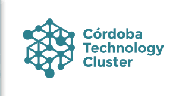
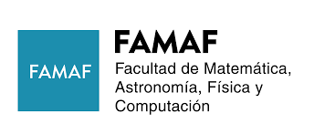

Somos una comunidad de mujeres que trabajan y estudian en áreas de computación, automatización, ciencia de datos y tecnología
en general. Centramos nuestro trabajo en la provincia de Córdoba, buscamos colaborar con otros grupos, reforzar la comunidad Argentina y ser parte de las redes regionales y
globales con objetivos y visiones similares.

Queremos encontrarnos, conocernos y que nuestro entorno nos conozca también

Nuestra visión es impulsar la participación de las mujeres en las áreas de tecnología, a través de la visibilización y valoración de nuestro trabajo. Queremos mejorar la equidad que tanto necesita la comunidad. Alrededor del mundo se están logrando avances increíbles a través de programas y colaboraciones locales, ¡te invitamos a sumarte para comenzar a generar cambio también en nuestro rincón del mundo!

---

<h1>Organizadoras</h1>

Soledad Salas        ·        Milagro Teruel        ·        Laura Alonso Alemany        ·        Soledad Palacios

<h1>Nos acompañan</h1>

